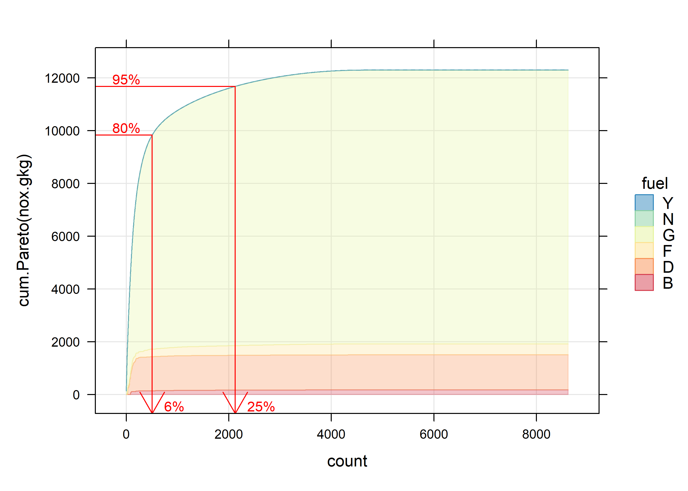

<!-- index.md is generated from index.Rmd. Please edit that file -->

# different.tan

<!-- badges: start -->
<!-- badges: end -->

R code for the analysis of vehicle emissions remote sensing systems
(VERSS).

> In development package

## Installation

You can install the development version of different.tan from
[GitHub](https://github.com/) with:

``` r
# install.packages("devtools")
devtools::install_github("karlropkins/different.tan")
```

## Contributing

**different.tan** is an in-development package, and contributions are
very welcome. We are using tidyverse contribution guidance regarding
code of conduct but are not strict as them regarding coding style…
[Contributions](https://karlropkins.github.io/different.tan/CONTRIBUTING.html)

## Examples

Load **different.tan** package and get some VERSS data, e.g. from the
Denver [FEAT Archive](https://digitalcommons.du.edu/feat/):

``` r
require(different.tan)
feat <- import_featdata("Fresno 21")
```

A quick Pareto analysis:

``` r
plot_Pareto(nox.gkg, fuel, data=feat, Pareto = "cum.Pareto", transpose.y.percent=c(80, 95))
```



Here, for example, we see that 95% of observed NOx emissions were
produced by about 25% of passing cars, and 80% were produced about 6% of
passing cars.
